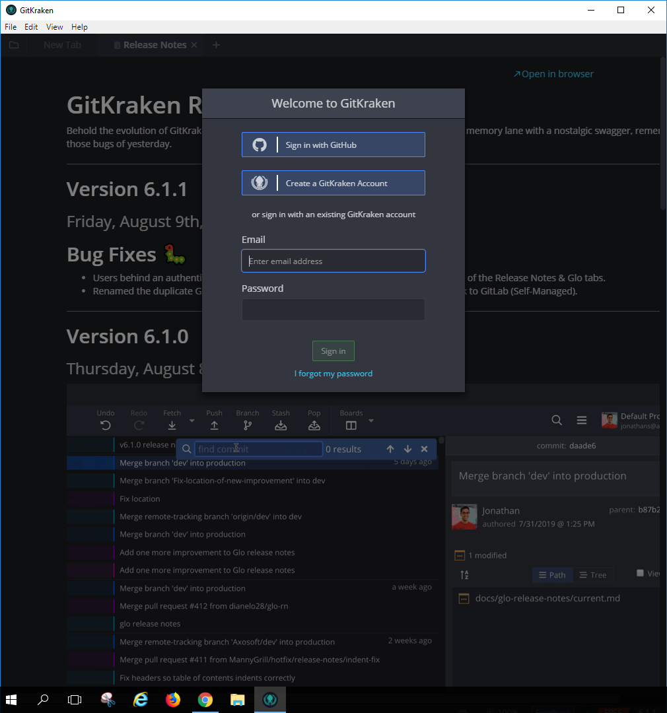
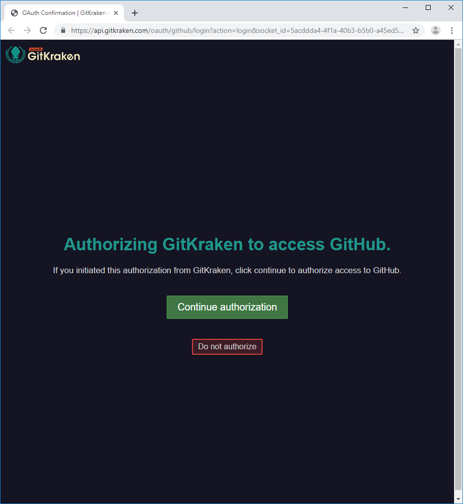
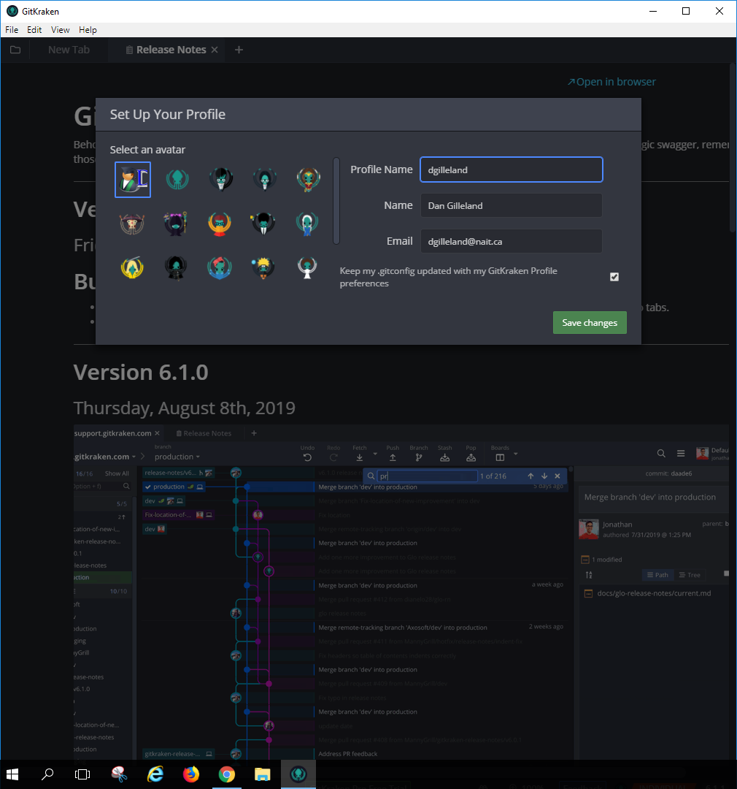
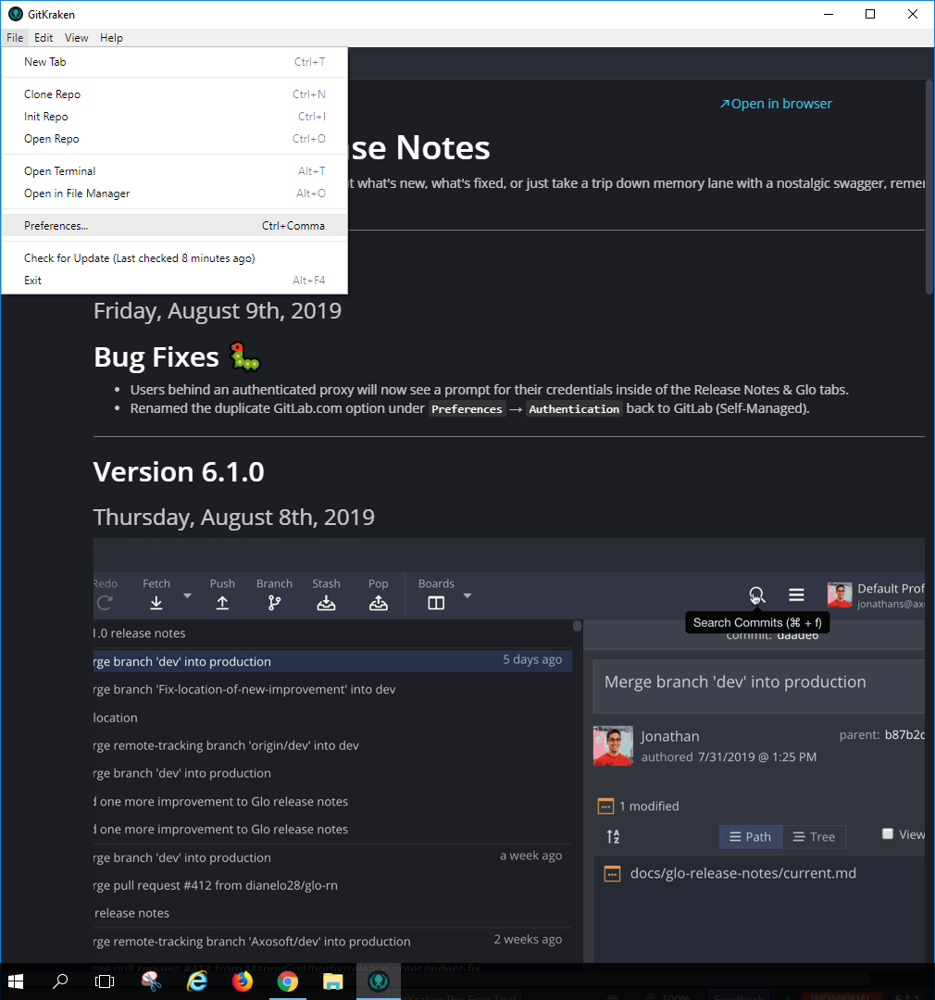
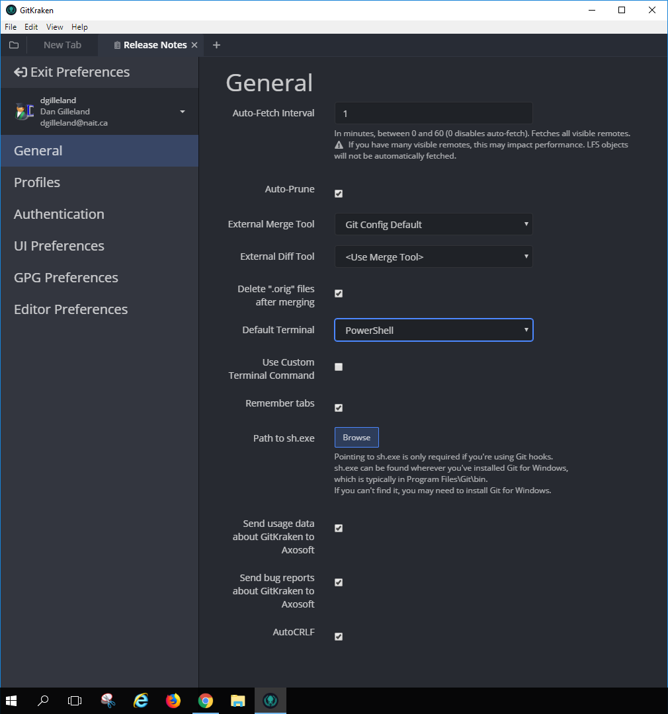
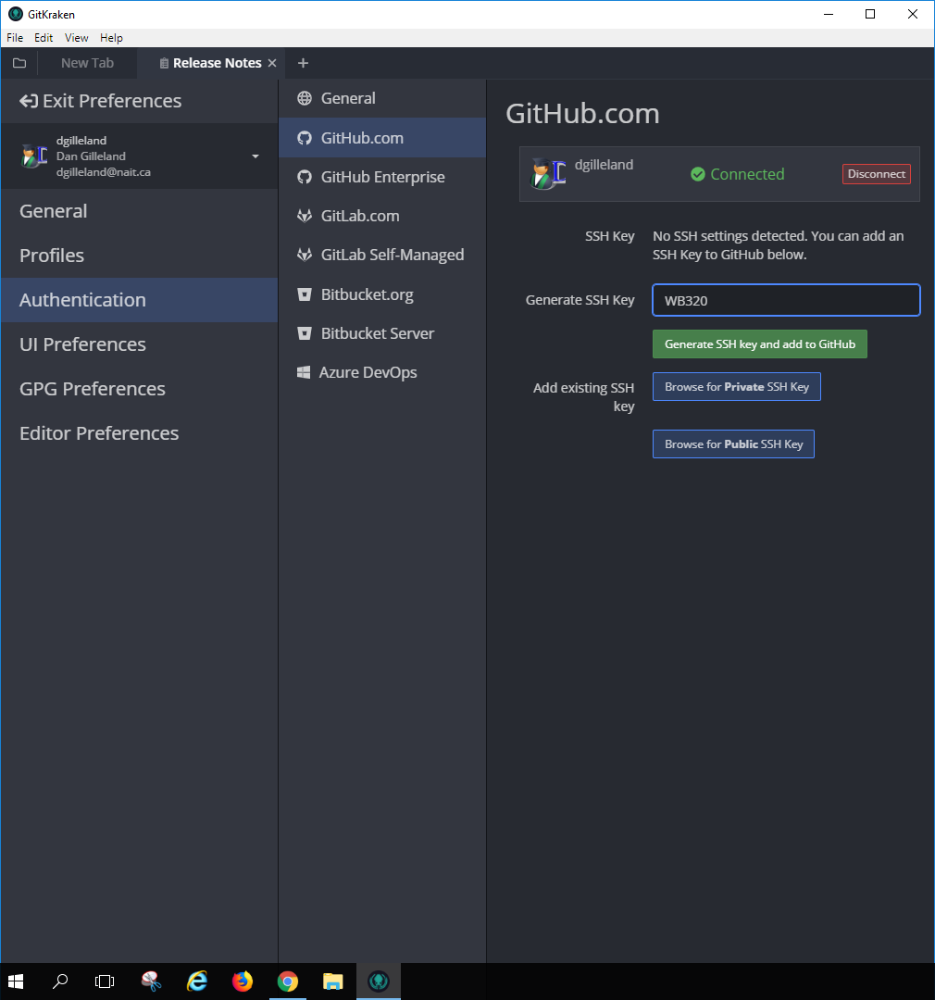

# Kraken It Open

After you download GitKraken, you should do the following to get things coordinated with your GitHub account.

- Sign in with GitHub and setup your profile.
- Under *File -> Preferences...*,
  - under *General*, setup your common settings.
  - under *Authentication* for *GitHub*, generate a **SSH** key to use in the classroom.

----

## Sign in with GitHub

## Setup Profile

## Open Kraken Preferences

## General Preferences

## Authentication Preferences

Setting up a SSH key for accessing your GitHub repositories is a good way to go, especially if you have two-factor-authentication set up with GitHub.

